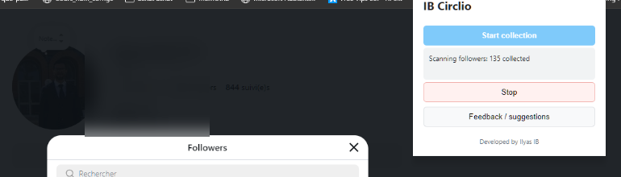
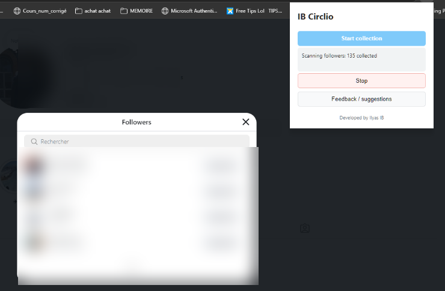
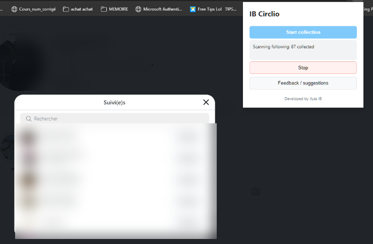
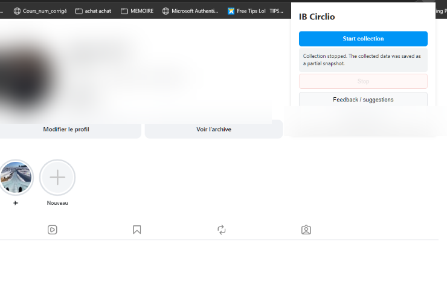
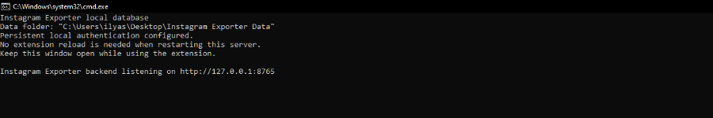
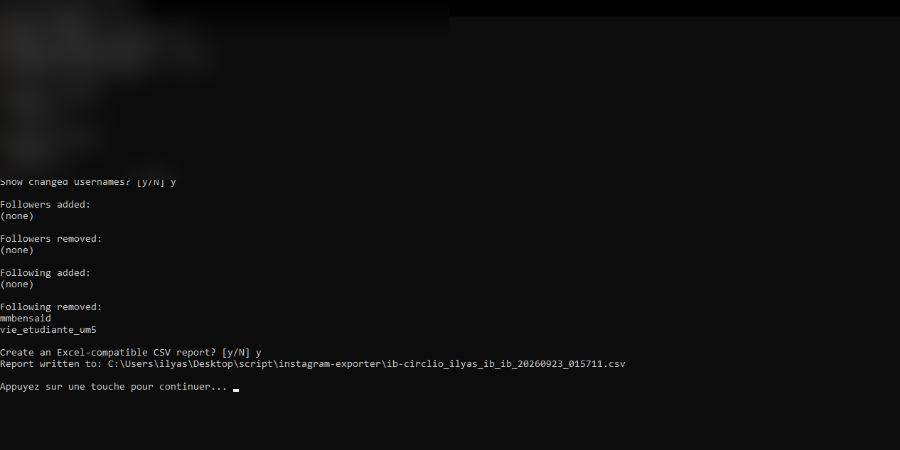

# IB Circlio — Instagram Follower & Following Tracker

IB Circlio is a free, open-source **Instagram follower and following tracker**. It works as a **local Instagram follower history tool**: collect snapshots over time, detect **new followers**, **removed followers (unfollowers)**, and **following changes**, compare any two dates, and save everything **locally with SQLite** — no cloud, no account data leaves your machine.

[](https://github.com/xxkyser-ctrl/IB_Circlio/releases/latest)
[](https://github.com/xxkyser-ctrl/IB_Circlio/issues)
[](https://github.com/xxkyser-ctrl/IB_Circlio)

No cloud backend, no browser storage, no Instagram password, and no Instagram API credentials are required.

## Contents

- [Screenshots](#screenshots)
- [Download](#download)
- [Use the portable release](#use-the-portable-release-recommended)
- [Features](#features)
- [How It Works](#how-it-works)
- [Browse snapshots and compare dates](#browse-snapshots-and-compare-dates)
- [Supported browsers](#supported-browsers)
- [Development mode](#development-mode-maintainers-only)
- [Report output](#report-output)
- [Local SQLite backend](#local-sqlite-backend)
- [Finding IB Circlio on GitHub](#finding-ib-circlio-on-github)
- [Security and privacy](#security-and-privacy)

## Screenshots

The screenshots below use a redacted demo profile. Usernames and account identifiers are not included.













Excel reports are generated as formatted workbooks with separate Summary and Changes sheets, colored headers, filters, usernames, and collection timestamps.

## Download

Download the latest `IB-Circlio-1.0.2-windows.zip` from the [GitHub Releases page](https://github.com/xxkyser-ctrl/IB_Circlio/releases/latest). Extract it, load the extracted folder as an unpacked extension, and double-click `run_server.bat`.

## Use the portable release (recommended)

Download the `IB Circlio-1.0.2-windows` release folder and keep its files together. It contains the extension files and four packaged Windows executables, so users do not need to install Python or any other runtime.

1. Open your browser's extensions page:
   - Chrome: `chrome://extensions`
   - Edge: `edge://extensions`
   - Brave: `brave://extensions`
   - Opera: `opera://extensions`
   - Vivaldi: `vivaldi://extensions`
2. Enable **Developer mode**.
3. Choose **Load unpacked** and select the downloaded release folder.
4. Open Instagram and log in normally.
5. Double-click `run_server.bat` in the same release folder. Keep its window open while collecting.
6. Navigate to the Instagram profile and click **Start collection** in IB Circlio.
7. Click **Stop** if needed. Everything collected before stopping is saved as a partial snapshot.
8. Double-click `result.bat` later to view changes or create a formatted Excel workbook.

The database and token are stored in `Desktop\Instagram Exporter Data`, not in the browser or the release folder.

## Features

- **Automatic snapshots:** collect Followers and Following from the active Instagram profile with one button.
- **Follower and following change detection:** identify new accounts, removed accounts, and changes between complete snapshots.
- **Dated local profile-picture archive:** save each encountered profile picture under the local data directory with its collection timestamp/version. If a user changes their image, the old and new files are both retained, and reports show the change. A persistent cache and same-run deduplication prevent downloading the same username twice; use `--refresh-avatars` when a fresh copy is needed.
- **Date-based browsing:** interactively choose any saved snapshot date and display followers, following, or both, including local avatar paths when available.
- **Arbitrary date comparisons:** compare any two snapshots in either order, not only the latest two.
- **Privacy-first storage:** SQLite, avatars, tokens, and reports remain on the PC.
- **Partial-save support:** stopping midway preserves collected data without using an incomplete snapshot as a future complete baseline.

## How It Works

1. The extension reads the visible Followers and Following dialogs on the active Instagram profile.
2. It extracts usernames and available profile-picture URLs, then sends one authenticated collection payload to the local server.
3. The SQLite backend saves the snapshot, stores a dated avatar version for that snapshot, downloads each unchanged avatar at most once per username, and reuses the persistent local avatar cache on later runs. Changed profile pictures create a new file instead of overwriting the older version.
4. Complete snapshots are compared with the selected earlier snapshot; partial snapshots are retained for inspection but excluded as comparison baselines.
5. Use `result.bat`, `result.bat browse`, or `result.bat compare --from DATE --to DATE` to inspect the history.

## Browse snapshots and compare dates

The report utility supports interactive snapshot browsing:

```text
result.bat browse
```

It lists available dates, accepts a number or date, then lets you display `followers`, `following`, or `both`. For scripting, compare any two dates:

```text
result.bat compare --from 2026-09-18 --to 2026-09-21 --list followers
```

Use `--list following` or `--list both` for the other relationship types. Running `result.bat compare` without dates keeps the backward-compatible latest-two comparison. Add `--refresh-avatars` to a collection/report command when you explicitly want cached profile pictures refreshed.

### Supported browsers

IB Circlio works in Chromium-based browsers that support Manifest V3, including Chrome, Microsoft Edge, Brave, Opera, Vivaldi, and other Chromium browsers. Load the release folder as an unpacked extension using that browser's extensions page.

Firefox uses a different Manifest V3 background format. For Firefox, load the same folder but rename `manifest.firefox.json` to `manifest.json` first, or copy the release folder and replace `manifest.json` with `manifest.firefox.json`. Do not use both manifest files at the same time. Firefox still needs the same local `run_server.bat`; the database remains on the PC and is never stored in browser storage.

### The only scripts users need

- `run_server.bat`: start IB Circlio's private local database service. Leave its window open while collecting.
- `result.bat`: open the interactive report menu for changed users, Excel exports, saved lists, comparisons, and the latest summary.
- `clear_database.bat`: permanently erase all saved data after a password and confirmation.

Users do not need to open Command Prompt or type commands. The extension itself is loaded once through the browser's **Load unpacked** button; after that, normal use is only opening `run_server.bat`, clicking **Start collection**, and later opening `result.bat`.

## Development mode (maintainers only)

1. Open the browser's extensions page.
2. Enable Developer mode.
3. Choose **Load unpacked**.
4. Select this `instagram-exporter` folder.
5. Open Instagram and log in normally.
6. Install Python 3 only for development, then double-click [run_server.bat](./run_server.bat). It creates `Desktop\Instagram Exporter Data` automatically, creates a persistent local authentication token once, and starts the SQLite service.
7. Navigate to the profile you want to monitor.
8. Open the extension popup and click **Start collection**. It opens Followers, collects the complete rendered list, closes it, opens Following, and collects that list.
9. Run **Start collection** again later to create a new complete snapshot. Use **Stop** at any time; collected data is saved as a partial snapshot.

Keep the server window open while using the extension. Close it when finished. Run the batch file once before loading the unpacked extension so it can generate `config.js`; after that, restarting the server does not require an extension reload because the token is persistent. The launcher validates and repairs the token automatically. The database is stored in the desktop data folder, not in the browser and not in the GitHub project.

### Clearing all database data

To permanently clear every profile, collection, username, and change:

1. Stop `run_server.bat`.
2. Double-click [clear_database.bat](./clear_database.bat).
3. The first run asks you to create a clear password twice.
4. Type `CLEAR` to confirm deletion.
5. Future runs require that password.

Only a salted PBKDF2 password hash is stored in `clear-password.txt`; the password itself is never stored. If the password is forgotten, delete `clear-password.txt` and create a new one. This does not recover deleted data.

### Viewing results

Double-click [result.bat](./result.bat) after a collection. Its interactive menu provides:

1. Show changed users from the latest complete snapshot.
2. Generate an Excel workbook for today's collection.
3. Generate an Excel workbook for any saved day.
4. Browse every saved Followers, Following, or combined list.
5. Compare two saved snapshots.
6. Show the latest collection summary.
7. Exit.

The command-line forms remain available: use `result.bat browse` to inspect an older snapshot or `result.bat compare --from DATE --to DATE --list both` to compare arbitrary dates. Browse output uses the avatar version belonging to the selected snapshot. The formatted `.xlsx` workbook includes profile-picture changes with the previous and current local image paths on the Changes sheet. The extension popup intentionally contains only **Start collection**, **Stop**, status/error messages, and **Feedback / suggestions**. Use `result.bat` for reports and `clear_database.bat` for administration.

## Report output

The result utility displays totals and changes with the collection timestamp and can create a formatted `.xlsx` workbook.

## Local SQLite backend

Collection data is stored by a local Python service in `Desktop\Instagram Exporter Data\instagram.db`; no browser storage is used by the backend. Start it before collecting:

For a manual start, run `py -3 server.py`. For normal use, double-click [run_server.bat](./run_server.bat). The batch files automatically use packaged `.exe` files when present and only fall back to Python in a source checkout.

## Maintainer commands, in order

End users do not need these commands. They are only for building and publishing a new release.

1. Install Python 3.13 or newer.
2. Run `py -3 -m pip install -r requirements-build.txt` — installs PyInstaller, which bundles Python into standalone `.exe` files.
3. Run `py -3 build_release.py` — creates the portable folder under `release\IB Circlio-1.0.2-windows`.
4. Zip that folder without changing its internal layout — this is the file to attach to a GitHub Release.
5. `git add .` — stages source changes, never generated private data.
6. `git commit -m "Release IB Circlio 1.0.2"` — records the changes locally.
7. `git push` — publishes the current branch to GitHub.

The build creates `ib-circlio-launcher.exe`, `ib-circlio-server.exe`, `ib-circlio-result.exe`, and `ib-circlio-clear-database.exe`. PyInstaller bundles the Python runtime and standard-library dependencies into those executables.

## Finding IB Circlio on GitHub

The repository is:

`https://github.com/xxkyser-ctrl/IB_Circlio`

If you are searching for an **Instagram follower tracker** or **Instagram follower checker**, IB Circlio records local snapshots instead of requiring a cloud service. It also works as an **Instagram unfollower tracker**: you can investigate **who unfollowed me on Instagram** by comparing two saved dates. For people interested in an **Instagram following tracker**, it reports both followers and following changes.

The project is also an **Instagram follower history** and **offline Instagram tracker** for users who want a privacy-first tool. It stores data in a local **Instagram SQLite database tracker** and can maintain an **Instagram profile picture archive** alongside each snapshot. The browser extension provides a free, open-source Instagram follower tracker workflow for Chromium browsers and Firefox.

Someone who does not know the project name can search GitHub for terms such as:

- `Instagram follower tracker`
- `Instagram following changes`
- `SQLite Instagram exporter`
- `local Instagram follower history`
- `Chrome extension Instagram followers`
- `Instagram unfollower tracker`
- `who unfollowed me on Instagram`
- `offline Instagram tracker`
- `Instagram profile picture archive`
- `free Instagram follower tracker open source`

For best discoverability, set the repository description to:

`Privacy-first Instagram follower & following tracker with local SQLite history, snapshots, and unfollower detection.`

Recommended repository topics:

`instagram`, `instagram-follower`, `follower-tracker`, `unfollower-tracker`, `instagram-tracker`, `sqlite`, `privacy`, `browser-extension`, `python`

These metadata values should be applied to the GitHub repository itself, not only kept in this README:

- Description: `Privacy-first Instagram follower & following tracker with local SQLite history, snapshots, and unfollower detection.`
- Topics: `instagram`, `instagram-follower`, `follower-tracker`, `unfollower-tracker`, `instagram-tracker`, `sqlite`, `privacy`, `browser-extension`, `python`

To set these on GitHub: open the repository, choose **Settings**, edit the **Description**, and add the topics in the **Topics** field. Users can then find the project by searching those phrases or topics.

The service listens only on `127.0.0.1:8765`, configured by generated `config.js`. Use [config.template.js](./config.template.js) as the publishable template. The database path can be changed with `--db path\to\file.db` (or `INSTAGRAM_DB`). Check that it is running with `GET /api/health`. The authenticated extension API uses `POST /api/collections`, `GET /api/collections/history`, and `DELETE /api/collections?profile=...`.

Every Instagram profile is an independent database group. The profile username is taken from the active Instagram URL, so the same database can safely contain collections from multiple accounts without mixing their followers, following lists, totals, or changes.

The extension never asks for credentials, reads cookies, calls Instagram APIs, or sends data to a remote server.

## Security and privacy

- The server binds to loopback only and requires a random bearer token for every data operation.
- The token is generated locally by `run_server.bat` and stored in ignored `config.js`; it is never committed.
- Browser-origin requests are rejected. CORS is not wildcard-enabled.
- The extension exposes only fixed database operations; it cannot request arbitrary local URLs.
- Timestamps are generated by the local server, not accepted from the browser.
- SQLite and Excel files contain sensitive social-graph data. Keep the desktop data folder and exported workbooks private.
- Do not commit `config.js`, `instagram.db`, SQLite journal files, or `.xlsx` exports.
- The server token is kept in the desktop data folder in `server-token.txt`; protect that folder and delete it if you want to revoke the token. The launcher validates and repairs invalid token files automatically.
- See [SECURITY.md](./SECURITY.md) for the threat model, vulnerability reporting, and release checklist.

## Suggested project names

- **IB Circlio** (recommended)
- **SocialPulse**
- **CircleTrack**
- **FollowLedger**
- **ProfileDelta**

## Notes

- Instagram must be displaying the profile page when **Start collection** is clicked.
- If Instagram is open in a tab from before the extension was installed, reload that Instagram tab once so Chrome injects the content script.
- The extension only collects usernames that Instagram renders in the dialogs; Instagram's loading, rate limits, or privacy restrictions can affect the result.
- A stopped collection is retained for inspection but is never used as the complete baseline for future comparisons.
